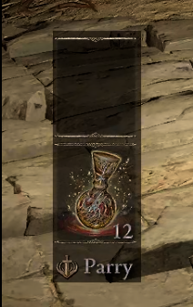

 
# DrawShape
Simple Reshade shader that draws a shape, colored w/ alpha.
## Usage
I made this to place rectangle and darken UI elements so my OLED don't burn up on games with bright static UI elements. It works with SpecialK HDR Retrofit.
## Installation
- ReShade: https://reshade.me/
- Put .fx files into reshade-shaders/Shaders
  - Spam copy paste to get more layers
